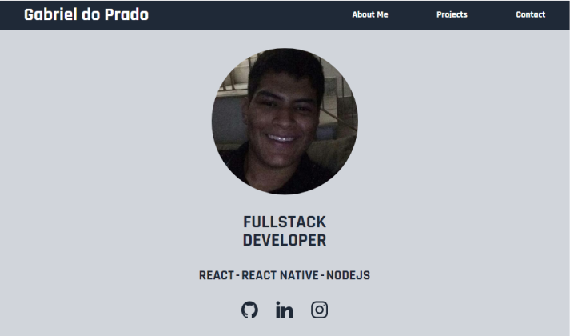

<h1 align="center">
  
</h1>

<h2 align="center">
  Gabriel Prado Dev
</h2>

  This is my personal portfolio. 
  It contains information about me, the projects I have make and the technologies I have worked on.

  

  

  

  

## Participants

[Gabriel do Prado](https://github.com/praadin)

## Techs

- [x] NextJs
- [x] Tailwind CSS
- [x] API Routes

## Main Learning

- [x] CSS Responsive Web Design
- [x] Send emails with Nodemailer

## Starting Dev Environment

1. Clone this repository. 
2. Run `npm install` or `yarn install`. 
3. Run `yarn start` and acces `http://localhost:3000`. 

## Link to Portfolio

[Gabriel Prado Dev](https://gabrielprado-dev.vercel.app/)
